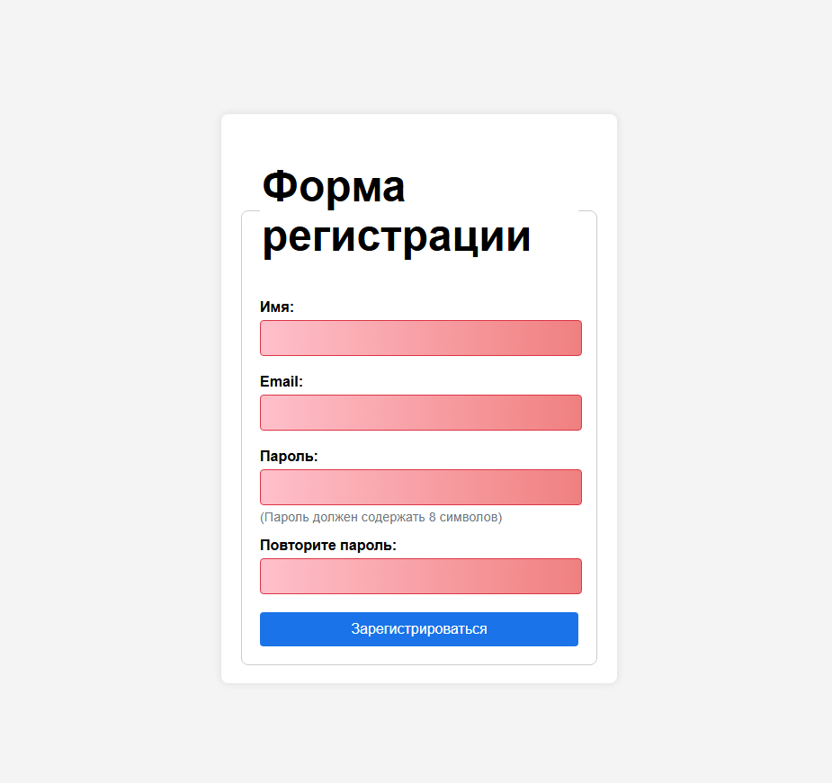

# interactive-form-demo
# Форма с валидацией на JavaScript

Этот проект представляет собой пример веб-формы с валидацией, реализованной на JavaScript.

## Скриншот формы



## Особенности
- Валидация в реальном времени.
- Кастомные сообщения об ошибках.
- Адаптивный дизайн.

## Как использовать
1. Склонируйте репозиторий:
   ```bash
   git clone https://github.com/LIGECT/interactive-form-demo.git
